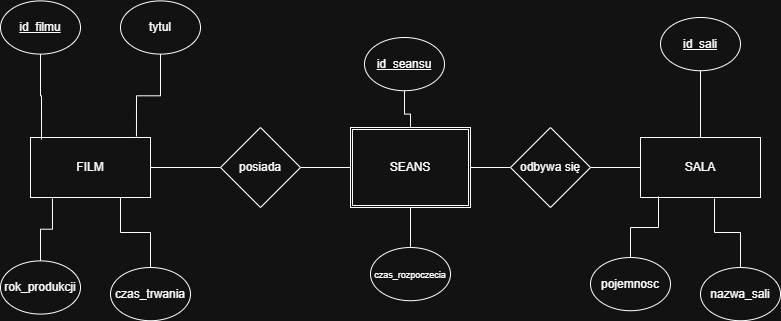
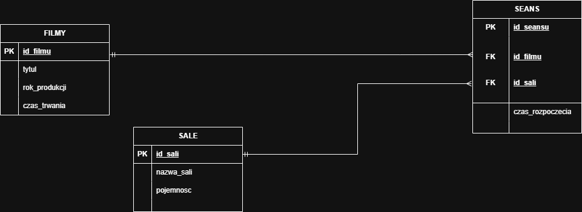

===========================================================
Rozdział 3. Planowanie baz danych i tworzenie dokumentacji
===========================================================

:Autor: Mateusz Gałecki 

3.1 Wybór zagadnienia i opis procesów
---------------------------------------

Do stworzenia wybrałem baze danych obsługującą system kina.

**Opis głównych procesów:**

* **Zarządzanie katalogiem filmów:** Wprowadzanie danych filmowych
* **Zarządzanie infrastrukturą:** Dane o salach kinowych ich pojemności i sprzedaży biletów
* **Planowanie repertuaru:** Przypisanie filmów dla konkretnych sal

3.2 Prototypowe dane
---------------------

Prototypowe pliki w formatach CSV i JSON.

**Format CSV:**

.. code-block:: text

   tytul_filmu,rok_produkcji,czas_trwania,nazwa_sali,pojemnosc,czas_rozpoczecia
   Matrix,1999,136,Sala 1,120,2026-06-25 18:00:00

**Format JSON:**

.. code-block:: json

   {
     "tytul": "Matrix",
     "rok_produkcji": 1999,
     "czas_trwania": 136,
     "nazwa_sali": "Sala 1",
     "pojemnosc": 120,
     "czas_rozpoczecia": "2026-06-25 18:00:00"
   }

3.3 Model konceptualny
-----------------------

Podzieliłem to na następujące elementy:

* **Encje silne:** Film, Sala (ich istnienie jest niezależne od innych)
* **Encje słabe:** Seans (jej istnienie jest uzależnione od innych encji)
* **Związki niepoprawne:** pozbyłem się związków wiele-do-wielu pomiędzy filmem a salą.

3.4 Model logiczny i normalizacja
-------------------------------------

Dane z prototypu poddałem normalizacji osiągając 3 postać normalną (3NF).

1. **1NF:** każda informacja znajduje się w osobnej kolumnie
2. **2NF i 3NF:** Usunąłem zależności częściowe i przechodnie.

Związki miedzy znormalizowanymi tabelami maja postać 1:N

* Jeden FILM może posiadać wiele SEANSÓW.
* Jedna SALA może posiadać wiele SEANSÓW.

3.5 Model fizyczny bazy danych
-------------------------------

Model bazy danych z podziałem na PostgreSQL i SQLite

**PostgreSQL**

.. list-table:: Model fizyczny bazy danych (PostgreSQL)
   :widths: 20 25 25 30
   :header-rows: 1

   * - Tabela
     - Kolumna
     - Typ danych
     - Klucz / Więzy
   * - filmy
     - id_filmu
     - SERIAL
     - PK
   * - filmy
     - tytul
     - VARCHAR(255)
     - NOT NULL
   * - filmy
     - rok_produkcji
     - INT
     - 
   * - filmy
     - czas_trwania
     - INT
     - NOT NULL
   * - sale
     - id_sali
     - SERIAL
     - PK
   * - sale
     - nazwa_sali
     - VARCHAR(50)
     - NOT NULL
   * - sale
     - pojemnosc
     - INT
     - NOT NULL
   * - seanse
     - id_seansu
     - SERIAL
     - PK
   * - seanse
     - id_filmu
     - INT
     - FK (filmy.id_filmu)
   * - seanse
     - id_sali
     - INT
     - FK (sale.id_sali)
   * - seanse
     - czas_rozpoczecia
     - TIMESTAMP
     - NOT NULL

**SQLite**

.. list-table:: Model fizyczny bazy danych (SQLite)
   :widths: 20 25 25 30
   :header-rows: 1

   * - Tabela
     - Kolumna
     - Typ danych
     - Klucz / Więzy
   * - filmy
     - id_filmu
     - INTEGER
     - PK AUTOINCREMENT
   * - filmy
     - tytul
     - TEXT
     - NOT NULL
   * - filmy
     - rok_produkcji
     - INTEGER
     - 
   * - filmy
     - czas_trwania
     - INTEGER
     - NOT NULL
   * - sale
     - id_sali
     - INTEGER
     - PK AUTOINCREMENT
   * - sale
     - nazwa_sali
     - TEXT
     - NOT NULL
   * - sale
     - pojemnosc
     - INTEGER
     - NOT NULL
   * - seanse
     - id_seansu
     - INTEGER
     - PK AUTOINCREMENT
   * - seanse
     - id_filmu
     - INTEGER
     - FK (filmy.id_filmu)
   * - seanse
     - id_sali
     - INTEGER
     - FK (sale.id_sali)
   * - seanse
     - czas_rozpoczecia
     - DATETIME
     - NOT NULL
